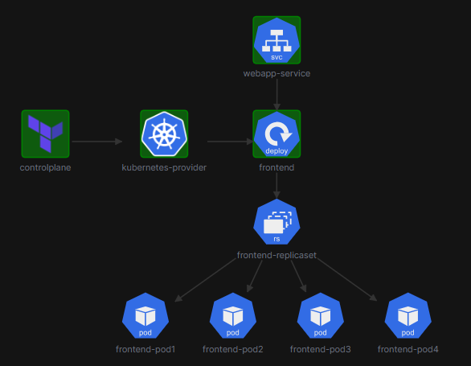

# Terraform Kubernetes Deployment Challenge 1

## Overview
This challenge demonstrates how to deploy a simple web application on Kubernetes using Terraform. The deployment consists of a frontend application with multiple replicas and a service to expose it.

## Architecture

The deployment has the following components:
- A Kubernetes Deployment with 4 replicas of the web application
- A Kubernetes Service exposing the application on a NodePort

## Components

### Frontend Deployment
- Image: `kodekloud/webapp-color:v1`
- Replicas: 4
- Container Port: 8080
- Labels: `name=webapp`

### Web Service
- Type: NodePort
- Port: 8080
- NodePort: 30080

## Implementation Details

The deployment is implemented using the following Terraform files:
- `provider.tf`: Configures the Kubernetes provider
- `frontend.tf`: Defines the Kubernetes deployment
- `webapp.tf`: Defines the Kubernetes service

## How to Deploy

1. Install Terraform and ensure you have access to a Kubernetes cluster
2. Run `terraform init` to initialize the Terraform providers
3. Run `terraform plan` to see the planned changes
4. Run `terraform apply` to deploy the application

Access the application at `http://<node-ip>:30080` after deployment.