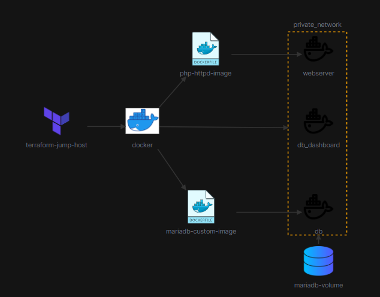

# Terraform LAMP Stack Deployment Challenge 2

## Overview
This challenge demonstrates how to deploy a complete LAMP stack (Linux, Apache, MariaDB, PHP) web application using Terraform and Docker containers. The deployment includes a custom database, a PHP-enabled Apache web server, and phpMyAdmin for database management.

## Architecture

The deployment has the following components:
- A custom MariaDB container with a preloaded database
- A PHP-Apache (httpd) container serving dynamic website content
- A phpMyAdmin container for database administration
- Docker network and persistent storage volumes for data durability

## Components

### MariaDB Container
- Image: Custom MariaDB built from `custom_db/Dockerfile`
- Database initialized with `custom_db/database.sql`
- Exposes port 3306
- Persistent volume for data storage

### PHP-Apache (httpd) Container
- Image: Custom PHP-Apache built from `php_httpd/Dockerfile`
- Serves website content from `website_content/`
- Exposes port 80
- Connected to the same network as MariaDB

### phpMyAdmin Container
- Image: Official `phpmyadmin/phpmyadmin`
- Exposes port 8080
- Linked to MariaDB for database management

### Network & Volumes
- Custom Docker network for inter-container communication
- Named volumes for MariaDB data persistence

## Implementation Details

The deployment is implemented using the following Terraform files:
- `provider.tf`: Configures the Docker provider
- `network.tf`: Defines the Docker network
- `mariadb-image.tf`: Builds the custom MariaDB image
- `mariadb-volume.tf`: Creates the MariaDB data volume
- `mariadb-container.tf`: Deploys the MariaDB container
- `php-httpd-image.tf`: Builds the custom PHP-Apache image
- `php-httpd-container.tf`: Deploys the PHP-Apache container
- `phpmyadmin-container.tf`: Deploys the phpMyAdmin container

## How to Deploy

1. Install Terraform and Docker on your system
2. Run `terraform init` to initialize the Terraform providers
3. Run `terraform plan` to review the planned resources
4. Run `terraform apply` to deploy the LAMP stack

After deployment:
- Access the website at `http://localhost`
- Access phpMyAdmin at `http://localhost:8080` (login with MariaDB credentials)