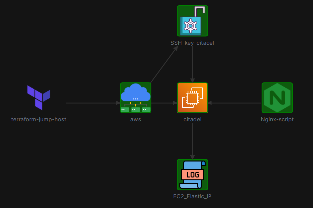

# Terraform AWS EC2 Nginx Deployment Challenge 3

## Overview
This challenge demonstrates how to deploy an Nginx web server on an AWS EC2 instance using Terraform. The deployment includes provisioning an EC2 instance, associating an Elastic IP (EIP) with it, and installing Nginx using a user data script.

## Architecture

The deployment has the following components:
- An AWS EC2 instance
- An Elastic IP (EIP) associated with the EC2 instance
- Nginx web server installed and running on the EC2 instance

## Components

### AWS EC2 Instance
- AMI: Defined by the `ami` variable (default: "ami-06178cf087598769c")
- Instance Type: Defined by the `instance_type` variable (default: "m5.large")
- Key Pair: Uses an existing public key (`.ssh/ec2-connect-key.pub`) to create `aws_key_pair.citadel-key` for SSH access.
- User Data: Executes `install-nginx.sh` to update the instance, install, and start Nginx.

### Elastic IP (EIP)
- An EIP is allocated and associated with the `citadel` EC2 instance.
- The public DNS of the EIP is written to `/root/citadel_public_dns.txt` on the instance.

### Nginx Web Server
- Installed via the `install-nginx.sh` script.
- The script updates package lists, installs Nginx, and starts the Nginx service.

## Implementation Details

The deployment is implemented using the following files:
- `provider.tf`: Configures the AWS provider and sets up localstack endpoints.
- `variables.tf`: Defines variables for region, AMI, and instance type.
- `main.tf`: Defines the `aws_key_pair`, `aws_instance`, and `aws_eip` resources.
- `install-nginx.sh`: Shell script executed as user data to install and start Nginx.

## How to Deploy

1. Ensure you have Terraform and AWS CLI installed and configured (even for localstack).
2. If using localstack, ensure it is running.
3. Navigate to the `challenge-3` directory.
4. Run `terraform init` to initialize the Terraform providers.
5. Run `terraform plan` to review the planned resources.
6. Run `terraform apply` to deploy the Nginx server on EC2.

After deployment:
- The public DNS of the EC2 instance (via the EIP) will be output by Terraform (if configured in outputs) or can be found in the `/root/citadel_public_dns.txt` file on the instance if you were to SSH into it.
- Access the Nginx default page by navigating to `http://<EIP_PUBLIC_DNS>` or `http://<EIP_PUBLIC_IP>` in your web browser.
